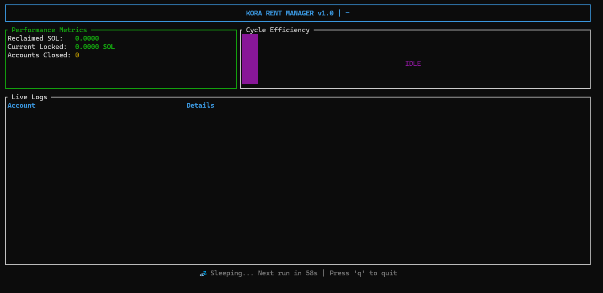
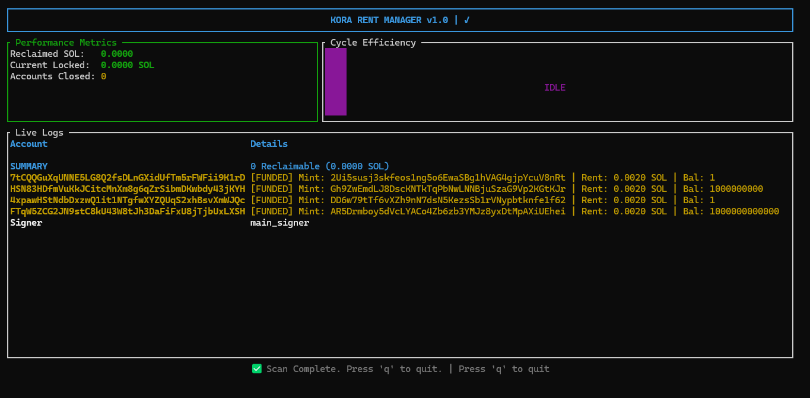
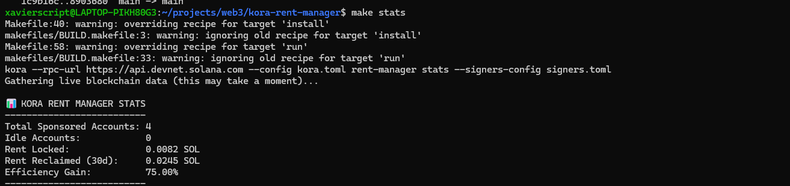
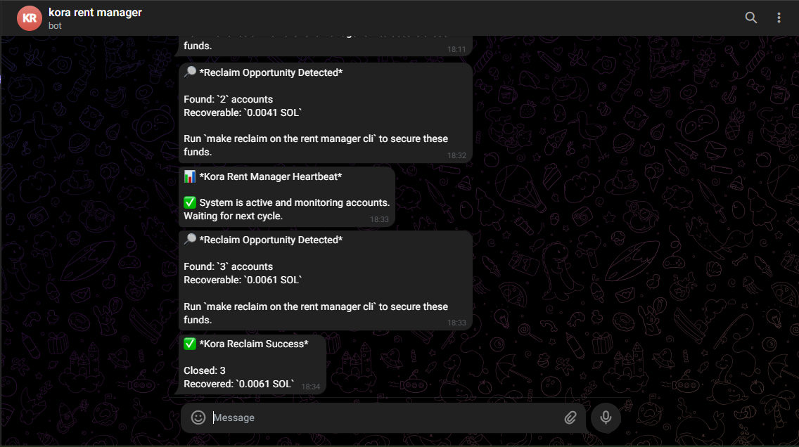
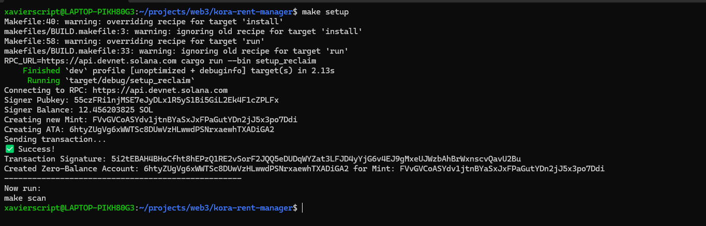
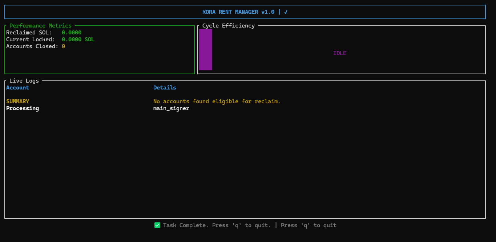
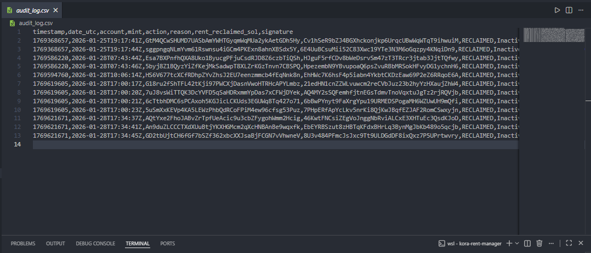
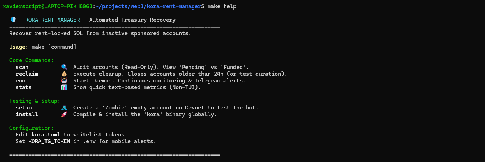

# 🛡️ Kora Rent Manager

[](https://www.rust-lang.org/)
[](https://solana.com/)
[](https://www.docker.com/)
[](LICENSE)

> **Automated Treasury Recovery for Kora Node Operators.**
> _Monitor, detect, and reclaim idle rent-locked SOL with safety and clarity._

---

## 📚 Table of Contents

- [Demo & Deep Dive](#demo-deep-dive)
- [Screenshots](#screenshots)
- [Project File Structure](#project-file-structure)
- [The Problem: Silent Capital Loss](#problem-silent-capital-loss)
- [How Kora Works & The "Rent Trap"](#how-kora-works)
  - [Kora: The Fee Abstraction Layer](#kora-fee-abstraction-layer)
  - [The Solana Rent Model](#solana-rent-model)
  - [Where the Lock Happens (The Leak)](#where-lock-happens)
- [The Solution: Kora Rent Manager](#the-solution)
  - [Key Features](#key-features)
- [Technical Context: How It Works](#technical-context)
  - [Solana Rent Mechanics](#solana-rent-mechanics)
  - [The Reclaim Logic](#the-reclaim-logic)
- [Getting Started](#getting-started)
  - [Quick Start with Docker](#getting-started-docker)
  - [System Requirements](#system-requirements)
  - [Prerequisites Installation](#prerequisites-installation)
  - [Installation and Setup](#installation-and-setup)
  - [Configuration](#configuration)
  - [Verification](#verification)
- [Usage Guide](#usage-guide)
  - [Scan (Read-Only)](#scan-read-only)
  - [Reclaim (Action)](#reclaim-action)
  - [Run Daemon (Background Service)](#run-daemon)
  - [Stats (Action)](#stats-action)
  - [Help](#help)
  - [View Logs](#view-logs)
- [Dashboard & Monitoring](#dashboard-monitoring)
  - [The TUI (Terminal User Interface)](#tui-terminal-user-interface)
  - [The Audit Log](#the-audit-log)
  - [Telegram Notifications](#telegram-notifications)
- [Advanced Configuration](#advanced-configuration)
- [Submission Checklist](#submission-checklist)
- [Troubleshooting](#troubleshooting)
- [Disclaimer](#disclaimer)
- [License](#license)
- [Contributing](#contributing)

<a id="demo-deep-dive"></a>

## 📺 Demo & Deep Dive

**▶️ WATCH THE WALKTHROUGH VIDEO HERE**
_https://www.loom.com/share/021e74ce74b14293808946eb0a58e326_

---

<a id="screenshots"></a>

## 🖼️ Screenshots

Quick visual tour — images are available in the `screenshots/` folder.

<p align="center">
  
</p>

<p align="center"><em>TUI dashboard showing cycle efficiency and live logs.</em></p>

<p align="center">
  
</p>

<p align="center"><em>Scan results with `Pending` and `Reclaimable` statuses.</em></p>

<p align="center">
  
</p>

<p align="center"><em>Cycle stats and reclaimed SOL summary.</em></p>

<p align="center">
  
</p>

<p align="center"><em>Heartbeat and notification examples (Telegram).</em></p>

<p align="center">
  
</p>

<p align="center"><em>Test/devnet setup for creating zombie accounts.</em></p>

<p align="center">
  
</p>

<p align="center"><em>Background daemon running in the terminal.</em></p>

<p align="center">
  
</p>

<p align="center"><em>CSV audit log view of reclaimed accounts.</em></p>

<p align="center">
  
</p>

<p align="center"><em>Help command for easier onboarding.</em></p>

---

---

<a id="project-file-structure"></a>

## 🗂️ Project File Structure

Below is a high-level overview of the main file and directory structure for this repository:

```
.
├── .env.example
├── Cargo.toml
├── Cargo.lock
├── Makefile
├── docker-compose.yml
├── Dockerfile
├── README.md
├── LICENSE.md
├── audit_log.csv
├── grace_period.json
├── kora.toml
├── signers.toml
├── rust-toolchain.toml
├── rustfmt.toml
├── screenshots/
├── target/
└── crates/
    ├── cli/
    │   ├── Cargo.toml
    │   └── src/
    │       ├── args.rs
    │       ├── main.rs
    │       ├── rent_manager/
    │       │   ├── mod.rs
    │       │   ├── config.rs
    │       │   ├── logic.rs
    │       │   ├── state.rs
    │       │   ├── tui.rs
    │       │   ├── types.rs
    │       │   └── utils.rs
    │       └── setup/
    └── lib/
        └── src/ ...
```

---

<a id="problem-silent-capital-loss"></a>

## 🚨 The Problem: Silent Capital Loss

Kora makes onboarding users to Solana seamless by sponsoring account creation fees. However, this convenience creates an operational gap: **Rent-Locked SOL**.

When a Kora node creates a Token Account for a user, it deposits ~0.002 SOL (Rent Exempt Minimum).

- If 1,000 users churn or empty their wallets, **2 SOL** remains locked on-chain.
- If 100,000 users churn, **200 SOL** is lost to "zombie" accounts.

Operators rarely have the time to manually audit thousands of accounts, check balances, and sign close transactions.

---

<a id="how-kora-works"></a>

## ⚙️ How Kora Works & The "Rent Trap"

To understand why this tool is necessary, it helps to understand the architecture of Kora and the Solana Storage Model.

<a id="kora-fee-abstraction-layer"></a>

### 1. Kora: The Fee Abstraction Layer

Kora acts as a Paymaster and Relayer. It sits between your application and the Solana network to provide "Gasless" transactions.

- The User signs a transaction to move tokens (USDC, BONK, etc.).
- The Kora Node validates the transaction and acts as the Fee Payer, covering the SOL network costs.
- The Result: Users interact with Solana without ever holding SOL.

<a id="solana-rent-model"></a>

### 2. The Solana Rent Model

On Solana, everything is an account, and every account takes up space on the validator's disk. To prevent spam, Solana charges Rent (approx. `0.002039 SOL` per Token Account).

- This SOL is deposited when an account is created.
- It is locked inside the account as long as the account exists.
- It is fully refundable if the account is closed.

<a id="where-lock-happens"></a>

### 3. Where the Lock Happens (The Leak)

In high-throughput Kora deployments—especially those involving custodial wallets, intermediate buffering, or rapid user onboarding—the Kora Operator often acts as the owner of the Token Accounts to facilitate transfers.

1. **Creation:** Kora creates a Token Account to receive or buffer user funds. The Operator pays the `~0.002 SOL` rent deposit.
2. **Usage:** The user interacts with the app, eventually withdrawing or spending their tokens.
3. **Abandonment:** The Token Account balance hits `0`. However, the account remains open on-chain.
4. **The Lock:** The `0.002 SOL` rent deposit remains locked in this empty "Zombie Account."

While 0.002 SOL seems trivial, a Kora node servicing 100,000 operations can easily end up with 200+ SOL ($30,000+) locked in inactive accounts. **Kora Rent Manager** automates the recovery of this dormant capital.

---

<a id="the-solution"></a>

## 🛠️ The Solution: Kora Rent Manager

This tool is a **set-and-forget** CLI utility and background service designed to close this operational gap. It provides a visual dashboard to monitor rent status and an automated daemon to reclaim funds safely.

<a id="key-features"></a>

### Key Features

- **📊 TUI Dashboard:** Real-time visualization of cycle efficiency, reclaimed funds, and active tasks using `Ratatui`.
- **🛡️ Safety Grace Period:** Built-in tracking ensures newly detected empty accounts are **never** closed immediately. They must remain empty for **24 hours** before being flagged as reclaimable.
- **📲 Telegram Alerts:** Passive monitoring. Get notified on your phone if idle rent exceeds a threshold (e.g., 5 SOL) or if a reclaim cycle succeeds.
- **💓 Heartbeat Reporting:** The daemon sends periodic "System Alive" snapshots to Telegram, ensuring operators know the bot is active without checking the terminal.
- **📜 Audit Trail:** Every action is logged to `audit_log.csv` for financial reconciliation.
- **⚙️ Configurable:** Customize scan intervals, thresholds, and whitelists via environment variables and CLI args.

---

<a id="technical-context"></a>

## 🧠 Technical Context: How It Works

<a id="solana-rent-mechanics"></a>

### Solana Rent Mechanics

On Solana, every account must hold a minimum amount of SOL (approx. 0.002039 SOL) to remain "rent-exempt." If an account has 0 tokens but still holds this SOL, it is essentially wasting space and money.

<a id="the-reclaim-logic"></a>

### The Reclaim Logic

The bot performs the following cycle:

1. **Scan:** It queries the RPC for all Token Accounts owned by the configured Signer.
2. **Filter:** It identifies accounts with `amount: 0` (Empty).
3. **Safety Check (The Tracker):**
   - _Is this account whitelisted?_ (Skip)
   - _Is this the first time we've seen it empty?_ (Mark as "Pending", start 24h timer).
   - _Has it been empty for >24 hours?_ (Mark as "Reclaimable").
4. **Execution:** If enabled, it constructs a `closeAccount` instruction, signs it with the operator's keypair, and sends it to the network.
5. **Alerting:** If the total rent reclaimed > 0 or total locked rent > Threshold, it fires a notification.

---

<a id="getting-started-docker"></a>

## 🐳 Quick Start with Docker (Recommended)

Skip the manual installation. Run Kora instantly in a secure, isolated container using Docker Compose.

### 1. Configuration

Ensure you have your configuration files in the root folder:

- `.env` (Environment variables - see `.env.example`)
- `kora.toml` (App config)
- `signers.toml` (Signer config)

### 2. Run the Interactive Menu

The easiest way to explore the available commands:

```bash
docker compose run --rm help
```

### 3. Docker Command Cheat Sheet

| Action              | Command                                 | Description                                                                                       |
| ------------------- | --------------------------------------- | ------------------------------------------------------------------------------------------------- |
| **Start Dashboard** | `docker compose run --rm scan`          | Opens the interactive TUI in your terminal (Read-Only).                                           |
| **Start Daemon**    | `docker compose run --rm run`           | Runs the monitoring service interactively.<br><br>_(Use `up -d run` for silent background mode)_. |
| **Reclaim (Safe)**  | `docker compose run --rm reclaim`       | Executes cleanup. Only closes accounts older than 24h.                                            |
| **Force Reclaim**   | `docker compose run --rm force_reclaim` | **⚠️ Danger:** Ignores grace period. Closes ALL empty accounts immediately.                       |
| **View Stats**      | `docker compose run --rm stats`         | Shows current efficiency metrics (Text mode).                                                     |
| **Setup Zombie**    | `docker compose run --rm setup`         | Creates a test "Zombie" account on Devnet for debugging.                                          |

---

<a id="getting-started"></a>

## 🚀 Getting Started (Manually)

<a id="system-requirements"></a>

### System Requirements

| Component             | Minimum / Recommended    | Notes                                                                    |
| --------------------- | ------------------------ | ------------------------------------------------------------------------ |
| Rust                  | 1.86+                    | Required to build the project and run the CLI.                           |
| Make                  | Package manager provided | Used by the `Makefile` targets (build, run, setup).                      |
| Kora CLI              | Latest                   | Optional but useful for managing a Kora node (`cargo install kora-cli`). |
| Node.js               | LTS                      | Required for TypeScript SDK / client tooling.                            |
| TypeScript            | Latest                   | For client-side development.                                             |
| Solana CLI (optional) | Latest                   | Helpful for key management and local devnet testing.                     |

---

### Prerequisites Installation

| Component             | Install Command                                                   | Notes                                                                              |
| --------------------- | ----------------------------------------------------------------- | ---------------------------------------------------------------------------------- | ------------------------------------------ |
| Rust                  | `curl --proto '=https' --tlsv1.2 -sSf https://sh.rustup.rs        | sh`<br>`source $HOME/.cargo/env`                                                   | Installs `rustc` and `cargo` via `rustup`. |
| Make (macOS)          | `xcode-select --install`                                          | Installs developer tools including `make`.                                         |
| Make (Ubuntu/Debian)  | `sudo apt-get update && sudo apt-get install build-essential`     | Installs `make` and common build tools.                                            |
| Make (Fedora/RHEL)    | `sudo dnf install make`                                           |                                                                                    |
| Make (Windows)        | Use WSL: https://docs.microsoft.com/en-us/windows/wsl/install     | Recommend running in WSL for full compatibility.                                   |
| Kora CLI              | `cargo install kora-cli`                                          | Optional helper CLI for managing Kora nodes.                                       |
| Solana CLI (optional) | `sh -c "$(curl -sSfL https://release.solana.com/stable/install)"` | Useful for devnet testing and key management; add the install path to your `PATH`. |

---

### Installation and Setup (Manually)

| Step                | Command                                                                                   | Purpose                                                                      |
| ------------------- | ----------------------------------------------------------------------------------------- | ---------------------------------------------------------------------------- |
| Clone repository    | `git clone https://github.com/xavierScript/kora-rent-manager.git && cd kora-rent-manager` | Get source code and enter project folder.                                    |
| Build               | `make install`                                                                            | Compile project; binary at `./target/release/kora-rent-manager`.             |
| Setup devnet zombie | `make setup`                                                                              | Create a test zombie account on devnet (requires devnet SOL in your wallet). |

---

### Configuration

#### Create `.env` and recommended variables

| Env Var                 | Example                         | Description                                                 |
| ----------------------- | ------------------------------- | ----------------------------------------------------------- |
| KORA_PRIVATE_KEY        | `your_base58_private_key_here`  | Operator private key (base58). Keep secret — do not commit. |
| SOLANA_RPC_URL          | `https://api.devnet.solana.com` | Optional custom RPC endpoint. Defaults to devnet if unset.  |
| KORA_TG_TOKEN           | `123456:ABC-DEF...`             | Telegram bot token for alerts (optional).                   |
| KORA_TG_CHAT_ID         | `987654321`                     | Telegram chat ID to receive alerts (optional).              |
| KORA_GRACE_PERIOD_HOURS | `24`                            | Override default grace period (hours).                      |

Create a `.env` file in the project root and add the needed variables.

**Security:** Never commit `.env` or keypair files. Add them to `.gitignore`.

---

### Verification

Before running the bot, verify your setup:

```bash
# Check if all dependencies are installed
rustc --version
cargo --version
make --version
kora --version
```

---

<a id="usage-guide"></a>

## 🎮 Usage Guide

We provide a Makefile for easy operation. Use the commands below to scan, inspect, and manage reclaim cycles.

| Action               | Command                                                        | Description                                                                                                                       |
| -------------------- | -------------------------------------------------------------- | --------------------------------------------------------------------------------------------------------------------------------- |
| **Scan (Read-Only)** | `make scan`                                                    | View the state of your accounts (populates Dashboard with `Pending`, `Reclaimable`, or `Funded`). Safe: no transactions are sent. |
| **Reclaim (Action)** | `make reclaim`                                                 | Close accounts that have passed the 24h Grace Period. Sends transactions to the network — review `make scan` results first.       |
| **Run Daemon**       | `make run`<br>`make run INTERVAL=1h`<br>`make run INTERVAL=5m` | Run the bot continuously. Default interval is 10s. Use `INTERVAL` to set custom sleep periods (e.g., `1h`, `5m`).                 |
| **Stats**            | `make stats`                                                   | Show current efficiency metrics and node/operator statistics.                                                                     |
| **Help**             | `make help`                                                    | Quick reference for available Makefile targets and usage.                                                                         |
| **View Logs**        | `cat audit_log.csv`<br>`csvlook audit_log.csv`                 | Inspect the CSV audit log of reclamation activity. Use `csvlook` from `csvkit` for pretty output.                                 |

---

<a id="dashboard-monitoring"></a>

## 📊 Dashboard & Monitoring

<a id="tui-terminal-user-interface"></a>

### The TUI (Terminal User Interface)

When running, the bot displays a rich terminal interface:

**Performance Metrics:** Real-time counter of SOL reclaimed.

**Cycle Efficiency:** A gauge showing how "optimized" your treasury is.

**Live Logs:** Detailed color-coded logs of every account checked.

- **YELLOW:** Account is empty but inside Grace Period.
- **GREEN:** Account successfully closed & rent recovered.
- **GREY:** Account is funded (Skipped).
- **RED:** High Rent Alert or Error.

<a id="the-audit-log"></a>

### The Audit Log

Check `audit_log.csv` for a permanent record:

```csv
timestamp,date_utc,account,mint,action,reason,rent_reclaimed_sol,signature
1706131200,2024-01-25T00:00:00Z,4xp...JQc,DD6...f62,RECLAIMED,InactiveGracePeriodPassed,0.0020,5Mz...123
```

<a id="telegram-notifications"></a>

### Telegram Notifications

If configured, you'll receive alerts for:

- **High Rent Alert:** When total locked rent exceeds threshold
- **Reclamation Success:** Summary of each successful cycle
- **Heartbeat:** Periodic status updates confirming the daemon is alive

---

<a id="advanced-configuration"></a>

## 🔧 Advanced Configuration

### Custom RPC Endpoint

For production, use a dedicated RPC provider. Example:

```bash
export SOLANA_RPC_URL=https://your-rpc-provider.com
```

| Provider  | Example / Notes                | Remarks                                                   |
| --------- | ------------------------------ | --------------------------------------------------------- |
| Helius    | See https://helius.dev/        | High-throughput, feature-rich analytics and RPC services. |
| QuickNode | See https://www.quicknode.com/ | Simple setup and global endpoints.                        |
| Triton    | See https://triton.one/        | Enterprise-grade RPC provider.                            |

### Whitelist Accounts

To prevent specific accounts from being closed, add them to `whitelist.json`:

```json
{
  "accounts": [
    "AccountAddress1111111111111111111111111",
    "AccountAddress2222222222222222222222222"
  ]
}
```

### Adjust Grace Period

Modify the grace period in your `.env`:

```dotenv
KORA_GRACE_PERIOD_HOURS=48  # Wait 48 hours instead of 24
```

---

<a id="submission-checklist"></a>

## 🏆 Submission Checklist

- [x] Monitors Accounts: Scans all token accounts for specific signers.
- [x] Detects Inactive: Filters for 0 balance & tracks inactivity duration.
- [x] Reclaims Rent: Uses `spl_token::instruction::close_account`.
- [x] Open Source: MIT License.
- [x] Safety: 24-hour Grace Period Tracker (`grace_period.json`).
- [x] Clarity: TUI Dashboard + CSV Audit Trail.
- [x] Alerts: Visual Dashboard Alerts + Telegram Push Notifications + Heartbeat Reports.

---

<a id="troubleshooting"></a>

## 🐛 Troubleshooting

### Common Issues

| Issue                      | Likely Cause                                     | Fix                                                                                          |
| -------------------------- | ------------------------------------------------ | -------------------------------------------------------------------------------------------- |
| `Command not found: make`  | `make` not installed                             | Install `make` (see Prerequisites table) or use WSL on Windows.                              |
| `Failed to connect to RPC` | `SOLANA_RPC_URL` misconfigured or network issues | Verify `SOLANA_RPC_URL` in `.env`, check network, or try a different RPC provider.           |
| `Invalid private key`      | Bad format or wrong environment variable         | Ensure `KORA_PRIVATE_KEY` is valid base58 or `signers.toml` references a valid keypair file. |

---

<a id="disclaimer"></a>

## ⚠️ Disclaimer

This tool deals with private keys and account deletion. While a 24-hour safety mechanism is implemented, please run `make scan` first to verify the state of your accounts. Use at your own risk.

**Security Best Practices:**

- Never share your private keys or `.env` file
- Test on devnet before using on mainnet
- Start with manual scans before enabling automated reclamation
- Monitor the first few cycles closely

---

<a id="license"></a>

## 📄 License

Licensed under MIT, following the original License by Kora.

---

<a id="contributing"></a>

## 🤝 Contributing

Contributions are welcome! Please feel free to submit a Pull Request.

---

Built with ❤️ by xavierScript.
